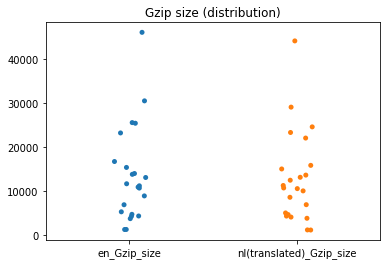
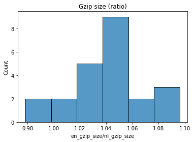
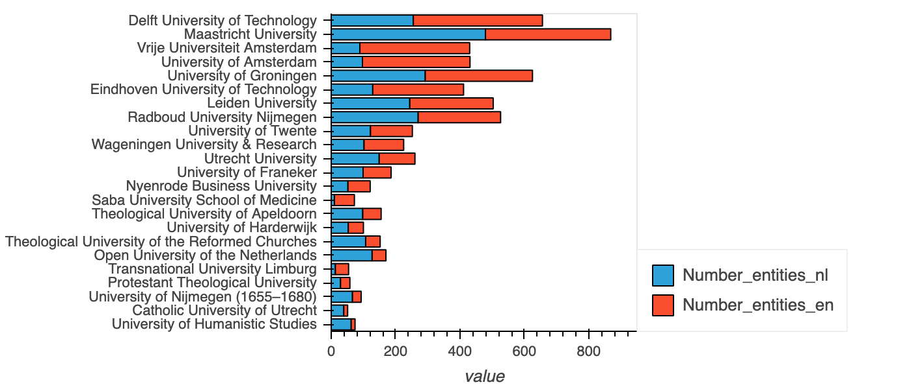
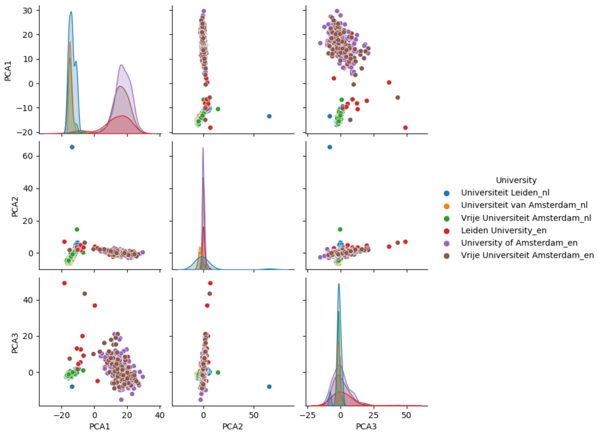
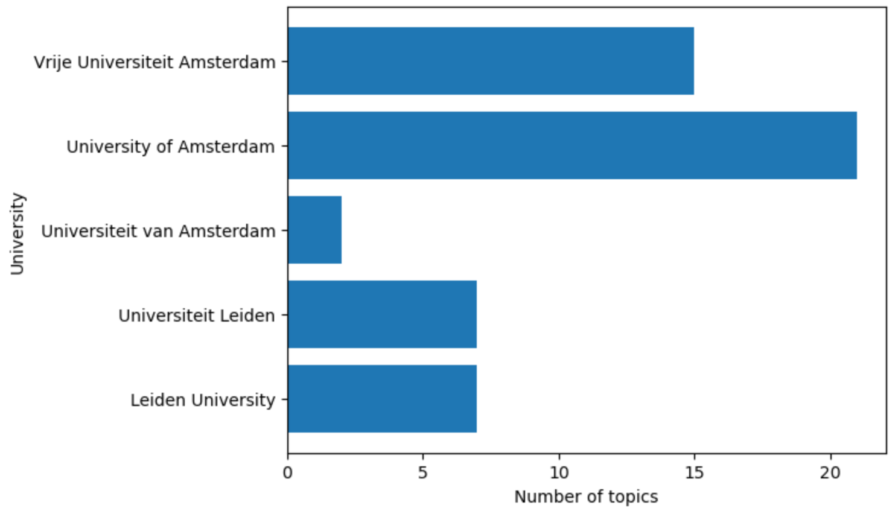
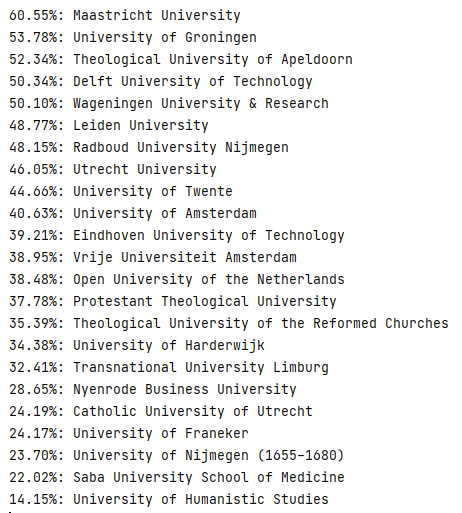
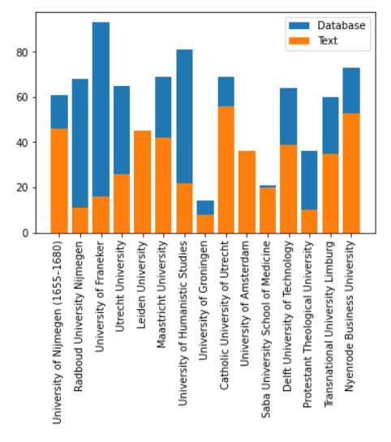
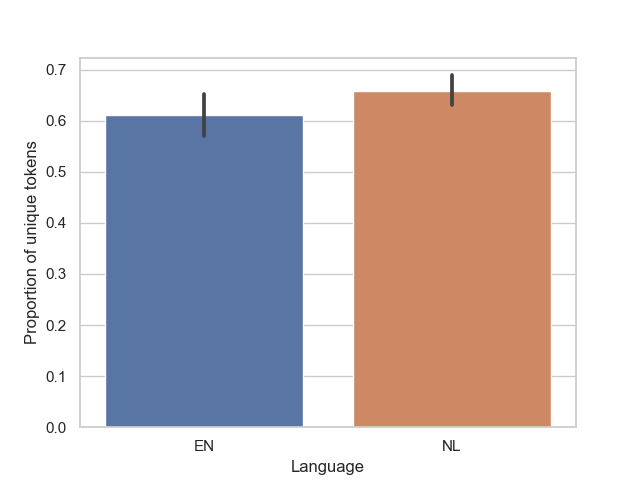
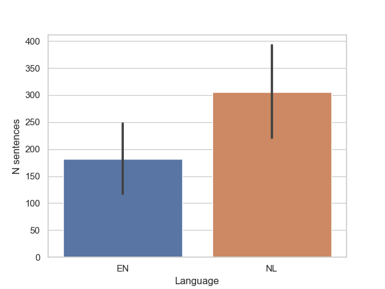
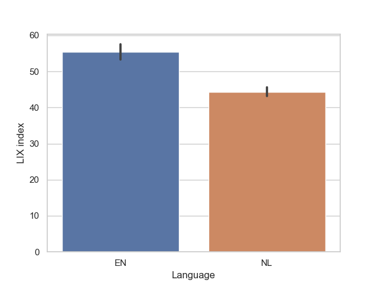

# WikiCompare: Comparing knowledge in wikipedia projects

The goal of this project is to compare the content/knowledge of different Wikipedia projects.
In particular, we are interested in multilingual Wikipedias and Wikidata. 

For example, looking at the University of Amsterdam:


| [UvA (Dutch)](https://nl.wikipedia.org/wiki/Universiteit_van_Amsterdam) | [UvA (English)](https://en.wikipedia.org/wiki/University_of_Amsterdam) | [UvA (Wikidata)](https://www.wikidata.org/wiki/Q214341)
| ------------- | ------------- | ------------ |
|   |    |    |


You see different content. The goal of this project to create quantative measures of the different. 

This is useful in the context of projects we work on in indelab.org which focus on adding knowledge to knowledge bases like Wikidata.

See for example:
* [Prompting as Probing: Using Language Models for Knowledge Base Construction](https://arxiv.org/abs/2208.11057) by Dimitrios Alivanistos, Selene Báez Santamaría, Michael Cochez, Jan-Christoph Kalo, Emile van Krieken, Thiviyan Thanapalasingam [Github](https://github.com/HEmile/iswc-challenge)
* [Inductive Entity Representations from Text via Link Prediction](https://dl.acm.org/doi/abs/10.1145/3442381.3450141)
Daniel Daza, Michael Cochez, and Paul Groth, in The Web Conference 2021. [Github](https://github.com/dfdazac/blp)

## Current Results

### Data
The results below are for Dutch univiersities as defined by the following [SPARQL query executed over Wikidata](https://query.wikidata.org/#SELECT%20%3Fitem%0AWHERE%20%7B%0A%20%20%3Fitem%20wdt%3AP31%20wd%3AQ3918%20.%0A%20%20%3Fitem%20wdt%3AP17%20wd%3AQ55%20.%0A%20%20%3FnlSite%20schema%3AisPartOf%20%3Chttps%3A%2F%2Fnl.wikipedia.org%2F%3E%20.%0A%20%20%3FenSite%20schema%3AisPartOf%20%3Chttps%3A%2F%2Fen.wikipedia.org%2F%3E%20.%0A%20%20%3FnlSite%20schema%3Aabout%20%3Fitem%20.%0A%20%20%3FenSite%20schema%3Aabout%20%3Fitem%20.%0A%7D)

```
SELECT ?item
WHERE {
  ?item wdt:P31 wd:Q3918 .
  ?item wdt:P17 wd:Q55 .
  ?nlSite schema:isPartOf <https://nl.wikipedia.org/> .
  ?enSite schema:isPartOf <https://en.wikipedia.org/> .
  ?nlSite schema:about ?item .
  ?enSite schema:about ?item .
}
```

This retrieve all entities of type (wdt:P31) univerity (wd:Q3918) who have a country (wdt:P17) of the Netherlands (wd:Q55). We then use [Pywikibot](https://www.mediawiki.org/wiki/Manual:Pywikibot) to retrieve the wikipedia pages from the Dutch and English wikipedias as well as the representation from Wikidata. We provide a handly [Duckdb file](https://github.com/UvA-DSC/WikiCompare/blob/main/data/dutchuniversities.duckdb) containing this downloaded information. 


### Comparison of number of sections between NL en EN wikipedias


### Word count: comparing the English pages and the Dutch pages translated to English

 

The word count distribution of the Dutch pages translated to English is more skewed than that of English pages. 
Concerning the ratios, the number of pages with a higher count of words in the English version (ratio > 1), is slightly higher than those having more words in the translated Dutch version.

### Gzip size: comparing the English pages and the Dutch pages translated to English

Wikipedia pages are zipped using the gzip algorithm. The size of the resulting file is an approximation of the algorithmic information content (or Kolmogorov complexity).

 

The distribution of the gzip size of the pages is pretty similar between English and translated Dutch pages. 
A one-to-one comparison (ratio) shows that most of the English pages contain more information than the translated Dutch pages.

### Comparision of the number of entities extracted 
Here we used the [pretrained small language models from Spacy](https://spacy.io/models/nl) for Dutch and English to do named entity recognition.




### From sentence embeddings to topics
For all sentences on all wiki pages we get vector embeddings. These are 300-dimensional, so here are the first three PCAs for some:



With DBSCAN we determine the number of clusters, i.e. topics in these texts and these compare as follows:



Statistics of similarity of EN and NL pages of UvA:


Similarity score of all Dutch Universities:
(Jaccard metric)




### Comparison of database entries to web page content
Here we compared the number of claims in the database to the entries in the Infobox for each university (exclusing those that did not have infoboxes)




For both langauges, we got some descritpives of them including words use number of sentences.






Using spacy, we also determined complexity of the texts. 
The LYX index takes into account the number of complex words (above 4 syllabus) in the texts.
