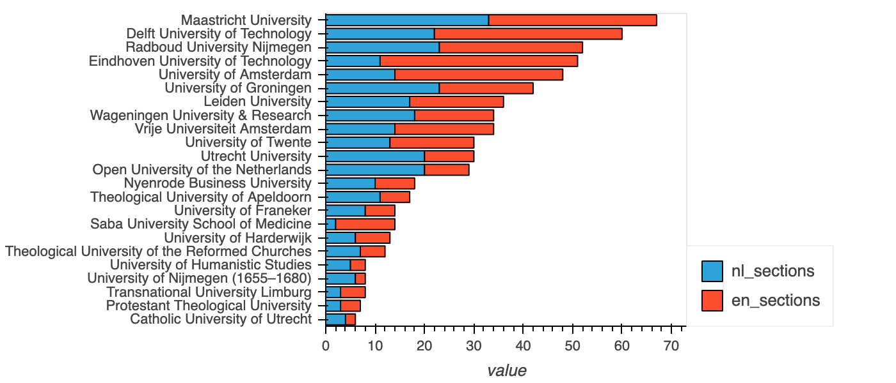

# WikiCompare: Comparing knowledge in wikipedia projects

The goal of this project is to compare the content/knowledge of different Wikipedia projects.
In particular, we are interested in multilingual Wikipedias and Wikidata. 

For example, looking at the University of Amsterdam:

| [UvA (Dutch)](https://nl.wikipedia.org/wiki/Universiteit_van_Amsterdam) | [UvA (English)](https://en.wikipedia.org/wiki/University_of_Amsterdam) | [UvA (Wikidata)](https://www.wikidata.org/wiki/Q214341)
| ------------- | ------------- | ------------ |
|   |    |    |

You see different content. The goal of this project to create quantative measures of the different. 

This is useful in the context of projects we work on in indelab.org which focus on adding knowledge to knowledge bases like Wikidata.

See for example:
* [Prompting as Probing: Using Language Models for Knowledge Base Construction](https://arxiv.org/abs/2208.11057) by Dimitrios Alivanistos, Selene Báez Santamaría, Michael Cochez, Jan-Christoph Kalo, Emile van Krieken, Thiviyan Thanapalasingam [Github](https://github.com/HEmile/iswc-challenge)
* [Inductive Entity Representations from Text via Link Prediction](https://dl.acm.org/doi/abs/10.1145/3442381.3450141)
Daniel Daza, Michael Cochez, and Paul Groth, in The Web Conference 2021. [Github](https://github.com/dfdazac/blp)

## Current Results

### Comparison of number of sections for Dutch Universities between NL en EN wikipedias

### Word count: comparing the English pages and the Dutch pages translated to English

